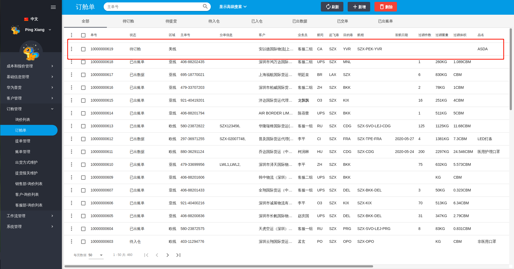
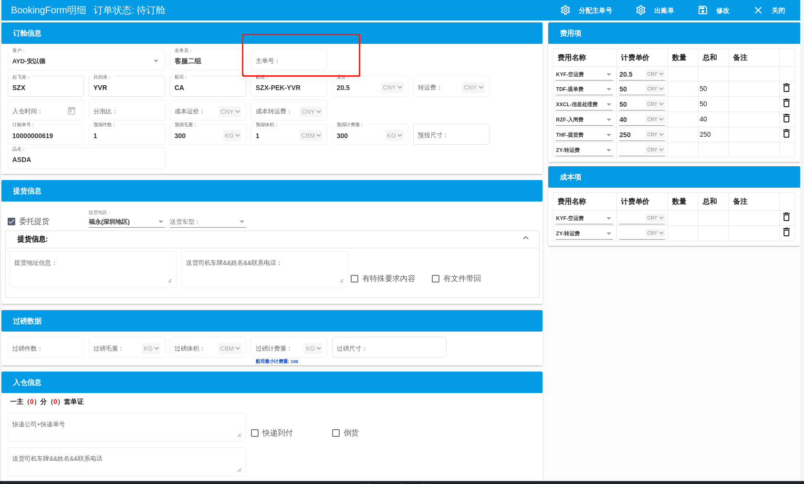
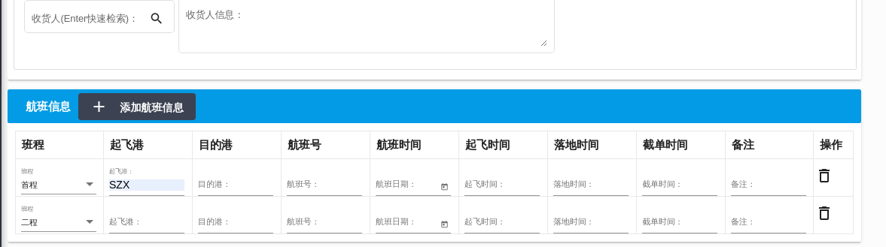
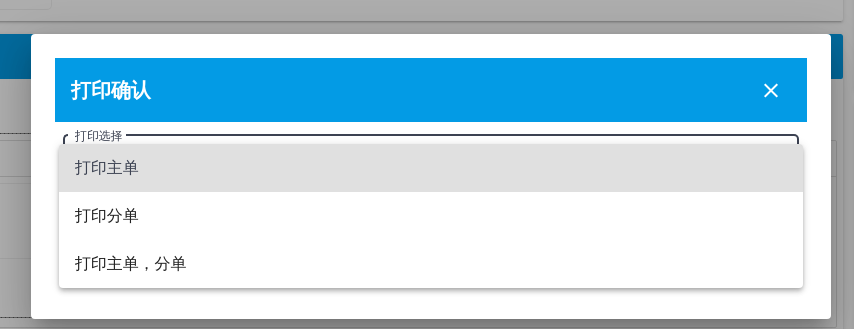
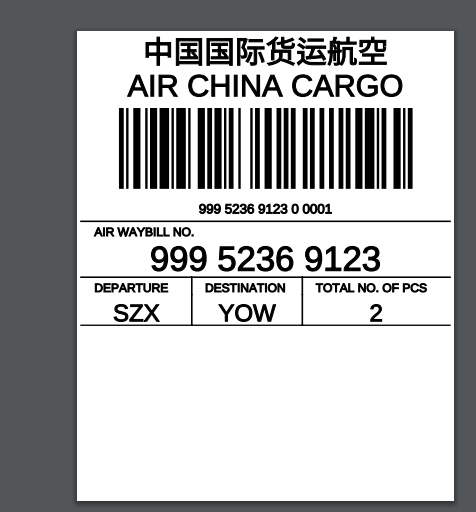

# 订舱单功能演示

1.询价下单后会在订舱单列表生成一条待订舱状态的数据

2.负责订舱同事订舱完成后可以进行完善信息(提货信息,航班信息等),然后可进行打印标签

3.后续流程操作同事可以进行完善订舱单信息,检查补全费用项,入仓信息,分单信息和报关信息,等待货物过磅后填写过磅信息
![enter description here](./images/bookingorder4.png

4.完善订舱单信息后,可以进行出单
